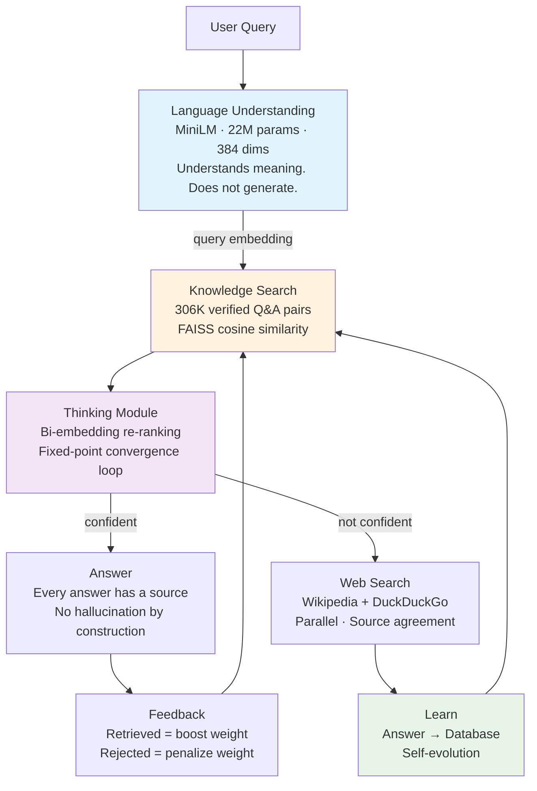
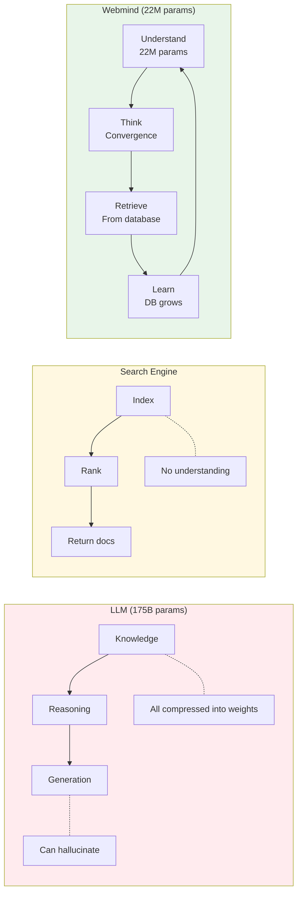
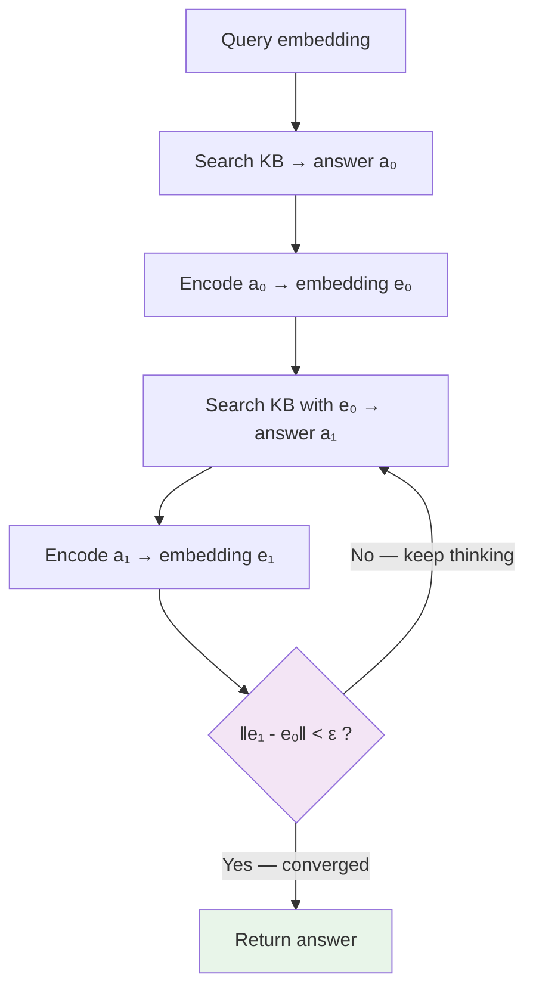
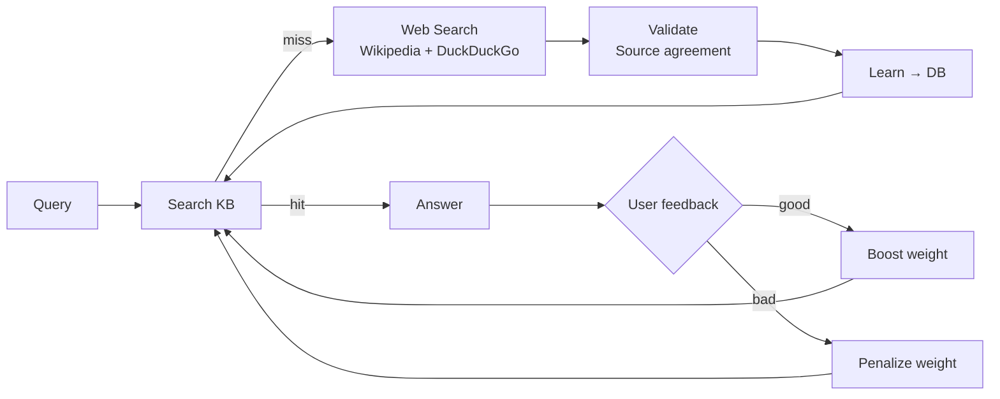

# Webmind — A Third Architecture for AI

**Not an LLM. Not a search engine. Something new.**

An LLM compresses all of human knowledge into billions of weights — then guesses. A search engine indexes documents — but doesn't understand them. Webmind takes a different path: a small language model that understands, a thinking module that converges, and a database that grows with every query.

**All you need is:**
1. **A model that understands language** (22M params, not 175B)
2. **A thinking module** (convergence loop in embedding space)
3. **A database** (the actual knowledge — explicit, traceable, evolving)

Everything else in an LLM — the decoder, the attention heads, the trillion tokens of training — is just an expensive way to approximate a database lookup.

**[Try it → webmind.sh](https://webmind.sh)** · **[Paper](papers/self-evolving-retrieval-2026-04-18.md)** · **[Benchmarks](benchmarks/)**

## Architecture



## Why This Is a New Architecture



| | LLM | Search Engine | Webmind |
|---|---|---|---|
| **What it stores** | Everything, compressed in weights | Documents, indexed | Only facts — explicit Q&A pairs |
| **Params needed** | 175B+ | N/A | 22M |
| **Learns from use** | No (retrain = $millions) | No (re-crawl) | Yes (every query) |
| **Hallucination** | Inherent | N/A | Impossible by construction |
| **Source traceable** | No | URL only | Full provenance per answer |
| **Runs on phone** | No | No | Yes (214MB) |
| **Useless weights** | ~99% storing memorized facts | N/A | 0% — encoder only understands language |

### The Insight

An LLM with 175B parameters is mostly storing facts — who wrote Hamlet, what's the capital of France, when did WW2 end. Those facts don't need neural weights. They need a database row.

The only thing that needs neural weights is **language understanding** — turning "what's the capital of France?" into a meaning vector. That takes 22M parameters, not 175B.

The rest — reasoning, convergence, learning — is search with iteration. No decoder needed.

## Key Results

### Self-Evolution (zero human intervention)

On questions the engine has **never seen before**:

| Dataset | First Encounter | After Self-Evolution |
|---------|----------------|---------------------|
| NaturalQuestions | 0.0% | 56.0% |
| TriviaQA | 0.0% | 66.0% |
| HotPotQA | 0.0% | 92.0% |

On **held-out data** (completely independent questions):
- First encounter: **0.7% EM**
- After self-evolution: **25.3% EM** (HotPotQA: 0% → 72%)

The engine taught itself. No human touched it between runs.

### Cross-Lingual (same embedding space)

| Language | Similarity to English |
|----------|----------------------|
| Hindi (नमस्ते) | 97.3% |
| Marathi (नमस्कार) | 97.4% |
| Spanish (Hola) | 96.2% |
| French (Bonjour) | 94.1% |

50+ languages. One model. One database.

## The Thinking Module



**Fixed-point iteration in embedding space.** The answer stabilizes when searching with the answer's own embedding retrieves the same answer. The system finds self-consistent knowledge.

This is how it "thinks" without a decoder — iterative search that converges on the right answer.

## The Self-Evolution Loop



Every miss makes the engine smarter. Every interaction adjusts weights. The database evolves. No retraining needed.

## Is This the Future of AI?

We think so. Here's why:

**LLMs are brute force.** They memorize everything — useful facts, training noise, copyrighted text — in one undifferentiated blob of weights. Then they guess what comes next. The 175B parameters aren't 175B units of intelligence — they're 175B units of compressed, lossy memorization.

**This architecture separates concerns:**
- **Understanding** → small encoder (22M params, well-studied, efficient)
- **Knowledge** → database (explicit, auditable, grows, never hallucinates)
- **Reasoning** → convergence loop (mathematical, deterministic, explainable)

The encoder can be upgraded independently. The database can grow without retraining. The reasoning module can be improved without touching either. Each component is replaceable and testable.

**What's left for LLMs?** Creative generation, open-ended conversation, tasks requiring true synthesis. For factual Q&A — knowing things and retrieving them accurately — this architecture is simpler, cheaper, more honest, and self-improving.

## Run It

```bash
# Live demo
open https://webmind.sh

# Local server
git clone https://github.com/tejasphatak/Synapse.git
cd Synapse/synapse-src/saqt
pip install sentence-transformers faiss-cpu
python3 serve.py
```

## What's Inside

| Component | Size | Purpose |
|-----------|------|---------|
| Language model (MiniLM) | 22M params | Understands meaning. That's all it does. |
| Knowledge base | 306K+ pairs | The actual intelligence. Grows from use. |
| Thinking module | ~200 lines | Convergence loop + bi-embedding re-ranking |
| Browser engine | 214MB total | Offline-capable. Works on phones. |

## Citation

```bibtex
@misc{phatak2026selfevolving,
  title={Self-Evolving Retrieval: A Third Architecture for AI Beyond Generation and Search},
  author={Phatak, Tejas},
  year={2026},
  url={https://github.com/tejasphatak/webmind-research}
}
```

## Credits & Acknowledgments

Built on the shoulders of these open source projects:

| Project | By | What we use it for |
|---------|-----|-------------------|
| [Open WebUI](https://github.com/open-webui/open-webui) | Open WebUI team | Frontend chat interface |
| [Sentence Transformers](https://www.sbert.net/) | Hugging Face / UKP Lab | Embedding model framework |
| [MiniLM](https://github.com/microsoft/unilm/tree/master/minilm) | Microsoft | Language understanding (22M params) |
| [FAISS](https://github.com/facebookresearch/faiss) | Meta AI | Vector similarity search |
| [Transformers.js](https://github.com/xenova/transformers.js) | Hugging Face | In-browser model inference |
| [ONNX Runtime](https://onnxruntime.ai/) | Microsoft | Cross-platform model execution |
| [Voy](https://github.com/tantaraio/voy) | Tantara | WASM vector search for browser |
| [Wikipedia API](https://en.wikipedia.org/api/) | Wikimedia Foundation | Web search source |
| [DuckDuckGo API](https://api.duckduckgo.com/) | DuckDuckGo | Web search source |
| [Google CSE](https://programmablesearchengine.google.com/) | Google | Programmable web search |

## License

Code: MIT · Papers: CC-BY 4.0
