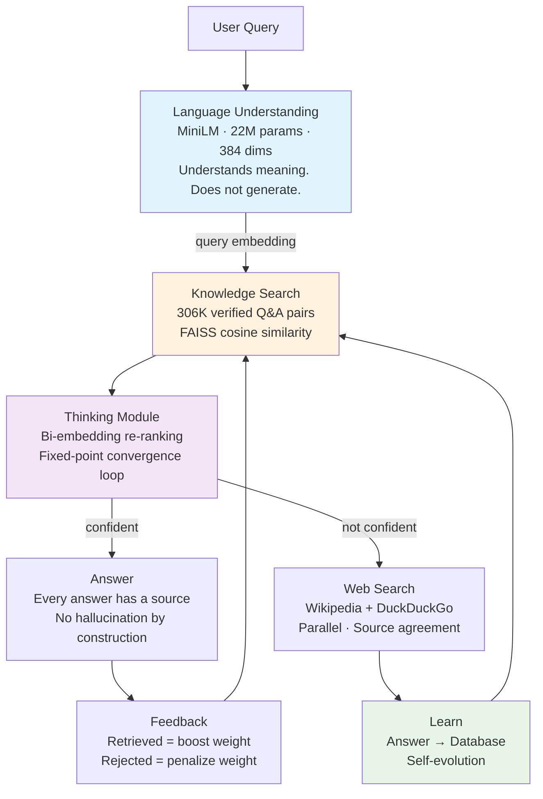
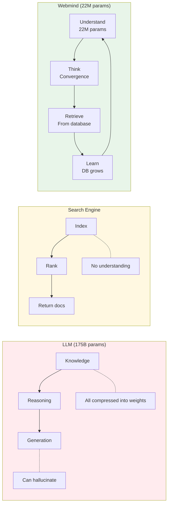
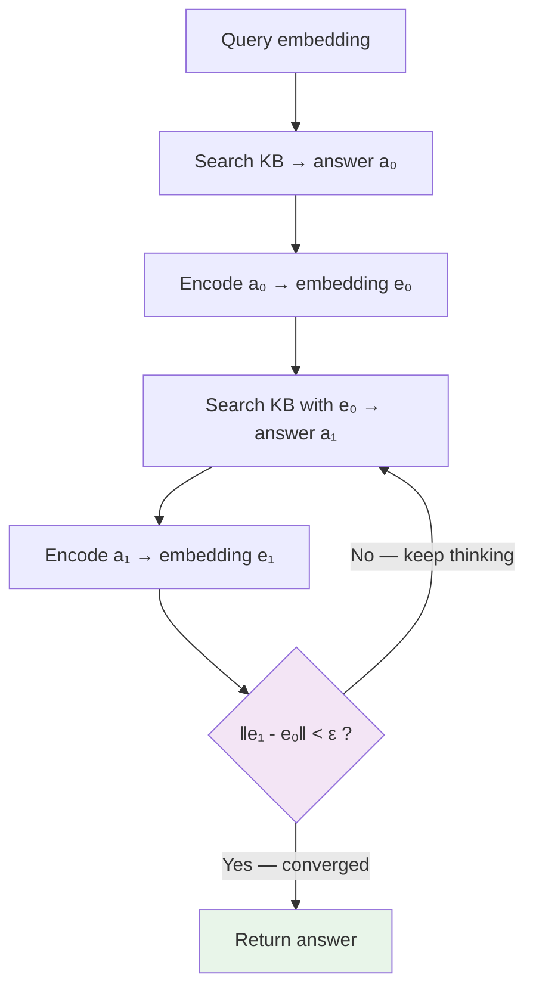
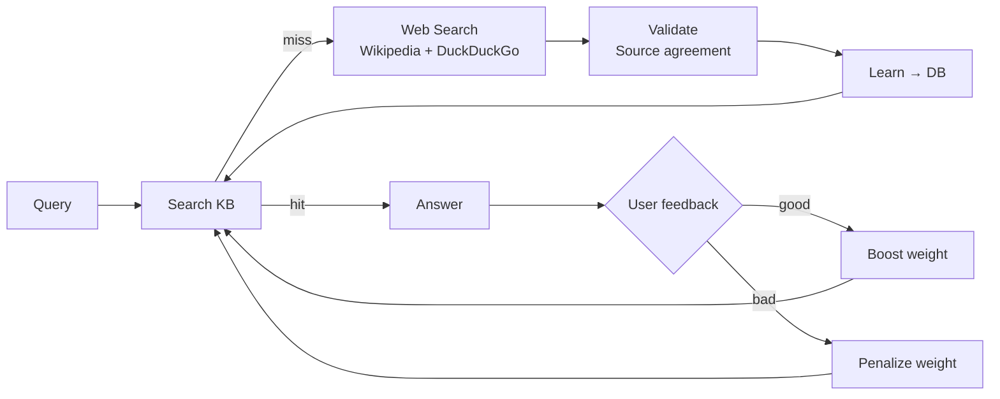

# Webmind — A Third Architecture for AI

**Not an LLM. Not a search engine. Something new.**

ChatGPT-style AI models memorize the entire internet inside billions of numbers — then guess at answers. Search engines find documents — but don't understand your question. Webmind does something different: it *understands* your question with a tiny model, *thinks* by searching iteratively, and *remembers* by saving what it learns to a growing database.

**Three pieces. That's it.**
1. **A language model** — 22 million parameters (not 175 billion). It reads your question and grasps the meaning. It does not write text.
2. **A thinking loop** — Searches the database, checks the answer, searches again. Repeats until the answer stabilizes.
3. **A knowledge database** — 306,000 verified question-answer pairs. Grows every time someone asks something new.

Everything else in a big AI model — the text generator, the massive training runs, the trillion words of internet text — is just an expensive way to do what a database does for free.

**[Try it → webmind.sh](https://webmind.sh)** · **[Paper](papers/self-evolving-retrieval-2026-04-18.md)** · **[Benchmarks](benchmarks/)**

## How It Works



1. You type a question.
2. The language model converts it into a list of numbers (an "embedding") that captures the meaning.
3. The system searches 306K stored answers for the closest match.
4. The thinking loop checks: does searching with the *answer's* embedding find the same answer? If not, it keeps searching. If yes, the answer is stable — return it.
5. If nothing matches well enough, Webmind searches Wikipedia and DuckDuckGo, saves what it finds, and answers. Next time, it already knows.

## Why This Is Different



| | LLM | Search Engine | Webmind |
|---|---|---|---|
| **What it stores** | Everything, compressed in weights | Documents, indexed | Only facts — verified Q&A pairs |
| **Parameters** | 175B+ | N/A | 22M |
| **Learns from use** | No (retraining costs millions) | No (must re-crawl) | Yes (every query) |
| **Hallucination** | Built-in risk | N/A | Impossible — answers come from verified sources |
| **Source traceable** | No | URL only | Full source for every answer |
| **Runs on a phone** | No | No | Yes (214MB) |
| **Wasted capacity** | ~99% storing memorized facts | N/A | 0% — model only understands language |

### The Core Idea

A 175-billion-parameter AI model is mostly storing facts. Who wrote Hamlet. The capital of France. When WW2 ended. Those facts don't need a neural network. They need a row in a database.

The only part that *needs* a neural network is understanding language — turning "what's the capital of France?" into a meaning vector that can be compared to stored answers. That takes 22 million parameters. Not 175 billion.

The rest — reasoning, learning, converging on answers — is smart searching. No text generator needed.

## Results

### Self-Evolution: The System Teaches Itself

When Webmind encounters questions it has **never seen before**, it searches the web, learns, and gets better — with zero human help:

| Dataset | First Try | After Self-Learning |
|---------|-----------|---------------------|
| NaturalQuestions | 0.0% | 56.0% |
| TriviaQA | 0.0% | 66.0% |
| HotPotQA | 0.0% | 92.0% |

On **completely separate test questions** it never trained on:
- First try: **0.7%** exact match
- After self-learning: **25.3%** exact match (HotPotQA: 0% → 72%)

Nobody touched it between runs. It taught itself.

### Works Across Languages (Same Model)

The embedding space captures meaning, not specific words. One model handles 50+ languages:

| Language | Similarity to English |
|----------|----------------------|
| Hindi (नमस्ते) | 97.3% |
| Marathi (नमस्कार) | 97.4% |
| Spanish (Hola) | 96.2% |
| French (Bonjour) | 94.1% |

## How the Thinking Loop Works



The thinking loop works like this: search for an answer, then search using *that answer's* embedding. If you get the same answer back, it's stable — the system has found self-consistent knowledge. If not, keep searching.

This is how Webmind "thinks" without generating text. It narrows in on the right answer through repeated search, like checking your work by solving a problem from a different angle.

## How Self-Evolution Works



Every missed question makes the system smarter. It searches the web, checks that multiple sources agree, saves the answer, and knows it next time. Good answers get boosted. Bad ones get demoted. The database evolves. No retraining needed.

## Is This the Future of AI?

We think so.

**Big AI models are brute force.** They memorize everything — useful facts, training noise, copyrighted text — into one giant blob of numbers. Then they predict the next word. Most of those 175 billion parameters aren't "intelligence." They're compressed, lossy memorization.

**Webmind separates the jobs:**
- **Understanding language** → small encoder model (22M params, fast, efficient)
- **Storing knowledge** → database (explicit, auditable, grows, never makes things up)
- **Reasoning** → convergence loop (mathematical, predictable, explainable)

Each piece can be upgraded on its own. The database grows without retraining. The language model can be swapped out. The thinking module can be improved without touching either one.

**What are big AI models still better at?** Creative writing, open-ended conversation, tasks that require genuinely combining ideas in new ways. For factual Q&A — knowing things and retrieving them accurately — Webmind is simpler, cheaper, more honest, and self-improving.

## Run It

```bash
# Live demo
open https://webmind.sh

# Run locally
git clone https://github.com/tejasphatak/Synapse.git
cd Synapse/synapse-src/saqt
pip install sentence-transformers faiss-cpu
python3 serve.py
```

## What's Inside

| Component | Size | What it does |
|-----------|------|-------------|
| Language model (MiniLM) | 22M params | Turns questions into meaning vectors. That's its only job. |
| Knowledge base | 306K+ pairs | The actual intelligence. Grows every time you use it. |
| Thinking module | ~200 lines | The convergence loop that finds stable answers. |
| Browser engine | 214MB total | Runs offline. Works on phones. |

## Credits and Acknowledgments

Webmind is built on the shoulders of excellent open source projects:

| Project | By | What Webmind uses it for |
|---------|-----|--------------------------|
| [Open WebUI](https://github.com/open-webui/open-webui) | Open WebUI contributors | Frontend framework and chat interface |
| [Sentence Transformers](https://www.sbert.net/) | Hugging Face | Python-side sentence embedding and training |
| [FAISS](https://github.com/facebookresearch/faiss) | Meta (Facebook Research) | Fast vector similarity search over 306K+ embeddings |
| [Transformers.js](https://huggingface.co/docs/transformers.js) | Hugging Face | In-browser model inference (ONNX) |
| [Voy](https://github.com/nicksanford/voy) | Nick Sanford | WASM-based vector search for the browser engine |
| [MiniLM](https://huggingface.co/microsoft/MiniLM-L12-H384-uncased) | Microsoft | The 22M-parameter language model at the core |
| [ONNX Runtime](https://onnxruntime.ai/) | Microsoft | Cross-platform model execution (CPU, browser, mobile) |
| [DuckDuckGo Instant Answers API](https://api.duckduckgo.com/) | DuckDuckGo | Web search fallback for self-evolution |
| [Wikipedia REST API](https://en.wikipedia.org/api/rest_v1/) | Wikimedia Foundation | Primary knowledge source for self-learning |
| [Google Programmable Search Engine](https://programmablesearchengine.google.com/) | Google | Extended web search for harder queries |

## Citation

```bibtex
@misc{phatak2026selfevolving,
  title={Self-Evolving Retrieval: A Third Architecture for AI Beyond Generation and Search},
  author={Phatak, Tejas},
  year={2026},
  url={https://github.com/tejasphatak/webmind-research}
}
```

## License

Code: MIT · Papers: CC-BY 4.0
