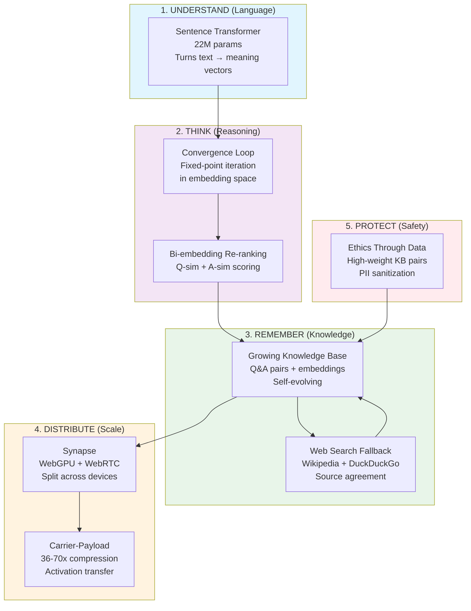
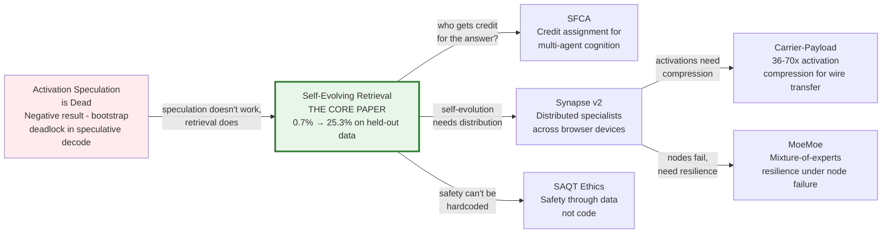
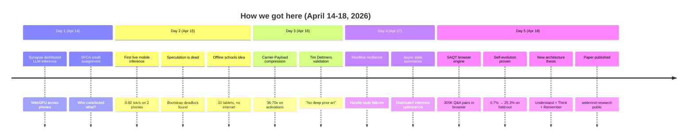

# Mindmap — How Everything Connects

> **Note:** This is a raw dump of ideas, not a scientific paper. It's a map of how the pieces *might* fit together. Some connections are proven. Some are speculative. Some might be wrong. The point is to see the whole picture and ask: does this hold up?

## The Big Picture

## The Thesis In One Sentence

**An LLM is a lossy database compressed into weights. We built a lossless one that grows.**

## How The Papers Connect

### What each paper actually says:

**1. Self-Evolving Retrieval** (the main paper)
- All you need: encoder (understand) + convergence loop (think) + database (remember)
- 175B params is overkill — 22M for understanding, rest goes in a database
- System teaches itself: 0.7% → 25.3% on held-out data, zero human intervention
- Runs in browser at 214MB
- *Status: benchmarked, results proven, paper drafted*

**2. SFCA — Shapley-Fair Credit Assignment**
- When multiple sources contribute to an answer, who gets credit?
- Relevant because: self-evolving system learns from KB + web + user feedback
- Each source's contribution should be tracked and credited
- *Status: pre-registered on Zenodo, code working*

**3. Activation Speculation is Dead**
- Tried speculative decoding for Synapse distributed inference
- Found a bootstrap deadlock: warmup needs verify(), verify needs pending, pending needs enabled
- Negative result — but it pushed us toward retrieval instead of generation
- *Status: published as negative result*

**4. Carrier-Payload Compression**
- 36-70x compression on activation tensors using PCA/VQ
- A 384-dim embedding (1.5KB) → ~40 bytes
- Directly relevant: if we distribute the KB across devices, embeddings need compression for transfer
- *Status: math proven, implementation pending*

**5. MoeMoe Resilience**
- What happens when a node in the distributed mesh goes down?
- Mixture-of-experts approach: route around failure
- Relevant for: school scenario with 30 tablets, kids disconnect randomly
- *Status: preliminary results on Zenodo*

**6. Synapse v2 — Distributed Specialists**
- Each device in the mesh specializes in a subset of the KB
- Query broadcasts → each device searches its shard → merge results
- This is how you scale from 300K pairs to 30M without any single device holding everything
- *Status: architecture designed, not yet validated for retrieval (only for inference)*

**7. SAQT Ethics**
- Safety taught through data, not hardcoded rules
- High-weight ethics pairs in the KB act as gravitational attractors
- PII sanitization strips personal data from learned content
- *Status: implemented, adversarial eval shows 48% — needs improvement*

## The Evolution of the Idea

## Connections That Might Work

### 1. Self-Evolving Retrieval + Synapse Distribution
- Shard the KB across 30 tablets
- Each holds 10K pairs (~7MB)
- Query broadcasts via WebRTC
- Each device searches its shard in parallel
- Carrier-Payload compresses embedding vectors for transfer
- **Question:** Does sharded retrieval lose quality vs centralized?

### 2. Convergence Loop + Distributed Search
- The convergence loop iterates: search → check → refine
- What if each iteration hits a DIFFERENT shard?
- Hop 1: device A finds a partial answer
- Hop 2: device B refines it with its shard
- Hop 3: device C converges
- **Question:** Does distributed convergence actually converge? Or does shard partitioning break it?

### 3. Self-Evolving Encoder + Carrier-Payload
- The encoder fine-tunes weekly from retrieval feedback
- Carrier-Payload compresses embeddings during transfer
- If the encoder shifts, the compression basis vectors shift too
- **Question:** Do we need to retrain compression after encoder fine-tune?

### 4. Ethics Through Data + Self-Evolution
- The system learns from the web automatically
- Ethics pairs try to block harmful content
- But the adversarial eval shows 48% pass rate
- **Question:** Can the ethics system evolve too? Can it learn new safety boundaries from user rejections?

### 5. SFCA + Self-Evolution Feedback
- When an answer is accepted, who gets credit?
- The original KB pair? The web search? The convergence loop?
- SFCA could attribute credit → boost the right sources
- **Question:** Is Shapley value computation fast enough for real-time retrieval?

## What's Speculative (Unproven)

- "Third architecture for AI" — reviewers say overclaimed
- Distributed retrieval across phones — P2P never connected in testing
- Self-evolving encoder — planned but not implemented
- Ethics through data alone — 48% adversarial pass rate is not enough
- School scenario — requires offline infra that doesn't exist yet
- Scale to 30M pairs — tested only at 300K

## What's Proven

- Self-evolution works: 0.7% → 25.3% on held-out data (HotPotQA: 0→72%)
- Bi-embedding re-ranking catches false positives (PCA→cupcakes bug)
- Convergence loop stabilizes answers (embedding delta < epsilon)
- Browser-native at 214MB — demo live at webmind.sh
- Multilingual: Hindi/Marathi at 92-97% similarity
- Web search + learn loop grows KB automatically (305K → 306K+ in one session)
- All code verified against claims (10/10 features have working code)

## The One Question

If you strip away all the grand claims and just look at what we built:

**A system that understands questions, searches a database, thinks iteratively, learns from mistakes, and gets better with every query — all in 214MB on a phone.**

Is that useful? Is that worth scaling? Is that the future, or a dead end?

We don't know yet. But the math works, the code runs, and the numbers go up.

---

*This mindmap will evolve as the research does. It's a living document.*
