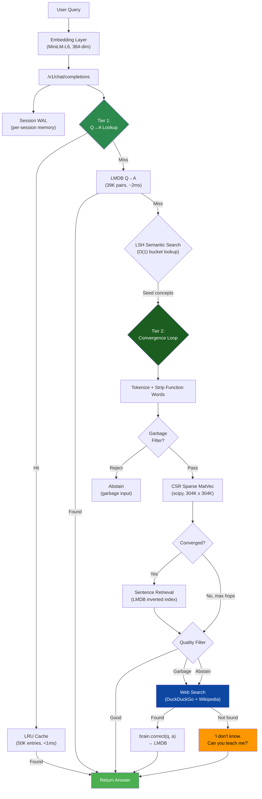
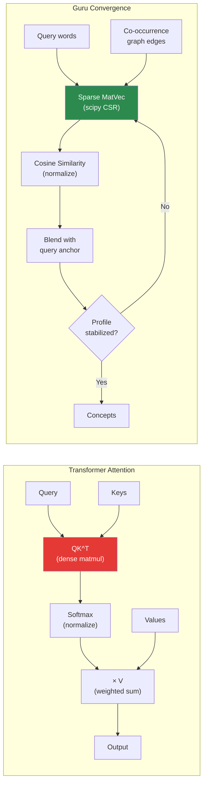
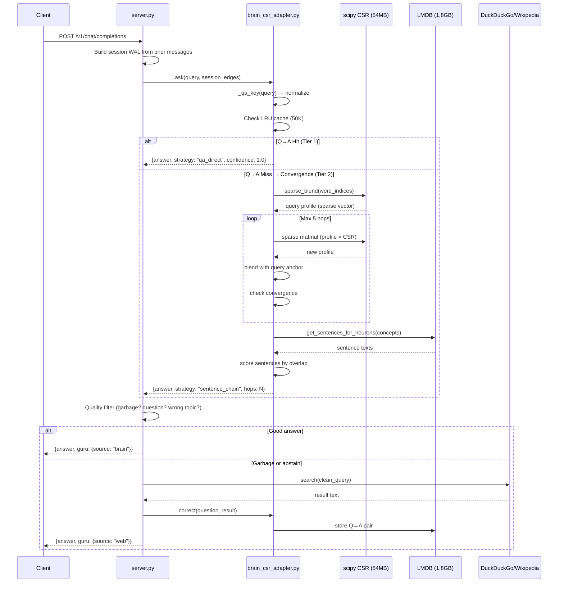
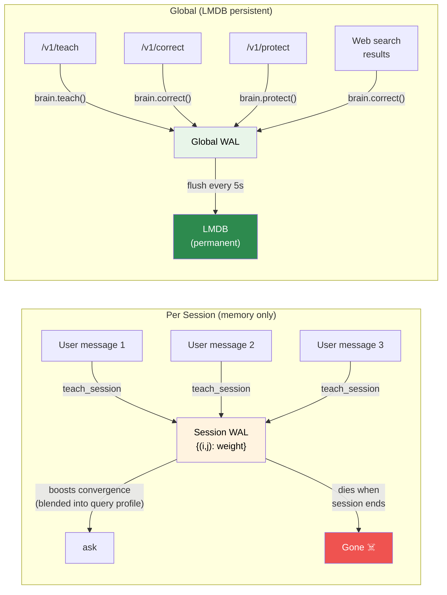
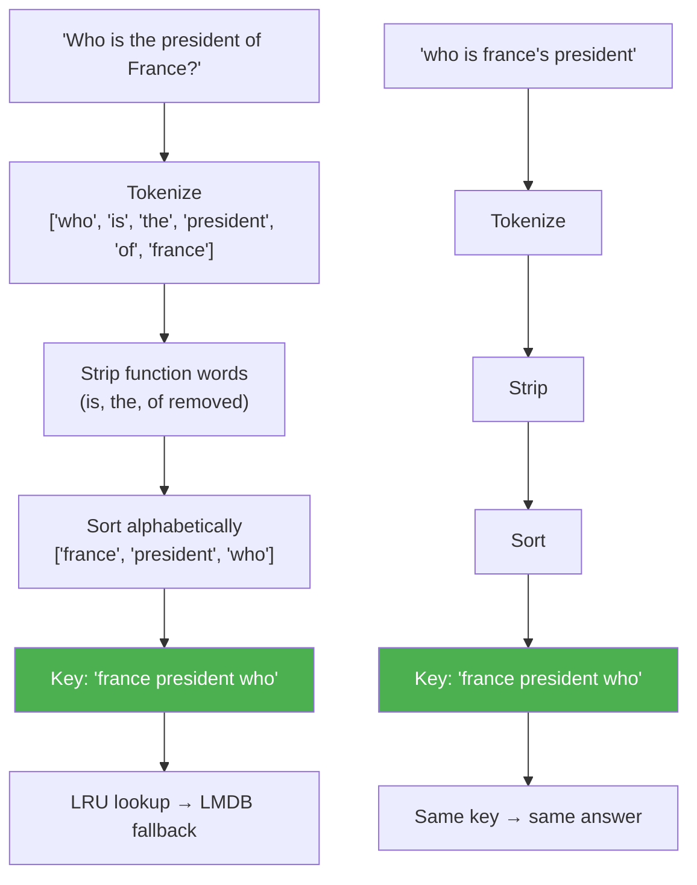
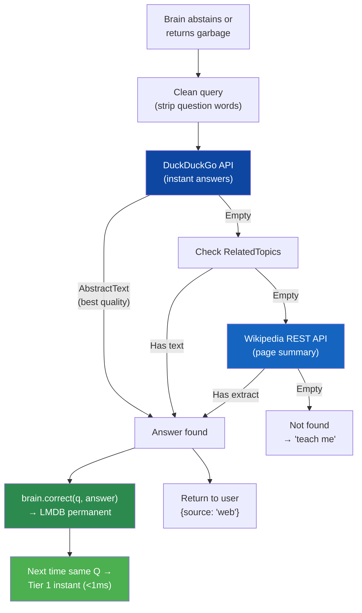
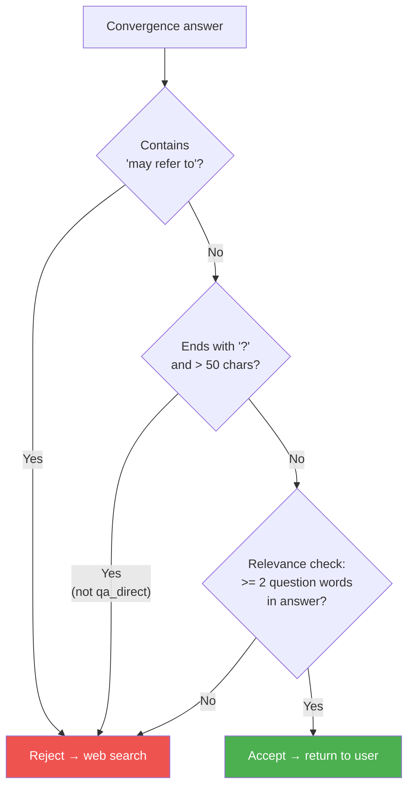
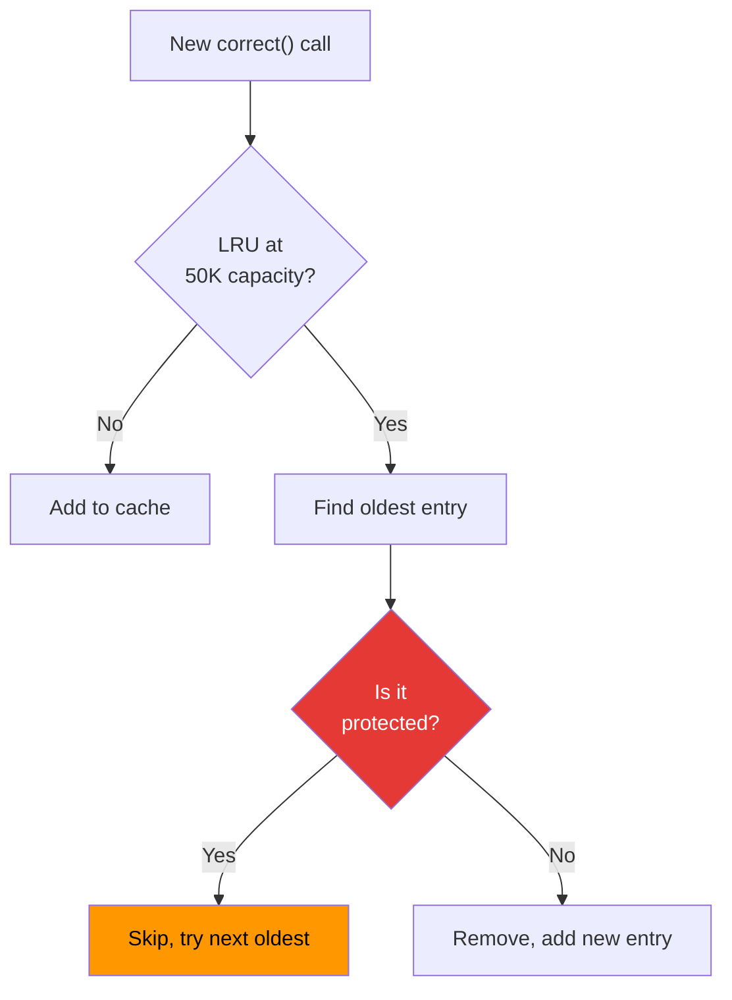

# Guru: Engineering Guide

**How it actually works — for software engineers.**

Tejas Phatak | April 2026 | [guru.webmind.sh](https://guru.webmind.sh) | [GitHub](https://github.com/tejasphatak/webmind-research) | [HuggingFace](https://huggingface.co/tejadabheja/guru)

---

## What Guru Is

A knowledge engine that replaces neural network weights with an editable graph database, augmented by dense embeddings (MiniLM-L6, 384-dim sentence transformer) for semantic understanding. No GPU. No gradient descent. No training. Learns from every conversation in real-time.

```
304K neurons | 7M edges | 39K Q→A pairs | 54MB CSR + 1.8GB LMDB | CPU only
```

**Two complementary subsystems:**
- **Structural layer** (co-occurrence graph): multi-hop reasoning through sparse graph traversal
- **Semantic layer** (MiniLM embeddings): synonym resolution, morphological linking, approximate nearest-neighbor search via LSH/ScaNN

This is not a keyword matcher — the embedding layer provides genuine semantic understanding ("car," "automobile," and "vehicle" map to nearby points in embedding space). This is not retrieval-only — the convergence loop chains concepts across multiple hops to compose answers from separately stored knowledge.

---

## System Architecture



---

## How Attention Works (Convergence Loop)

In a transformer, attention is: `softmax(QK^T / sqrt(d)) * V`

In Guru, the same operation is a sparse matrix-vector multiply over the co-occurrence graph:



### The Math

**Transformer:**
```
attention(Q, K, V) = softmax(QK^T / sqrt(d_k)) * V
```

**Guru (per hop):**
```
profile_new = CSR @ profile_old          # sparse matrix-vector multiply (= QK^T)
profile_new = profile_new / ||profile_new||  # normalize (= softmax)
profile_new = α * profile_new + (1-α) * query  # query anchor (= residual connection)
```

Where `CSR` is the co-occurrence matrix (304K x 304K sparse), `profile` is the current concept vector, and `α` decays from 0.9 to 0.5 across hops (early hops explore, later hops focus — like layer specialization in transformers).

| Transformer Concept | Guru Equivalent | Implementation |
|---|---|---|
| Token embeddings | MiniLM-L6 (384-dim) | Dense sentence-transformer embeddings; semantic similarity via cosine distance |
| Q (query) | Query word indices + embedding | `content_indices = [word_idx[w] for w in content_words]` + LSH seed lookup |
| K (keys) | CSR column entries + LSH buckets | `CSR[word_idx, :]` + ScaNN approximate NN |
| V (values) | CSR edge weights | `CSR.data` |
| Attention scores | Cosine similarity | `dot(profile, CSR[j]) / (norm(profile) * norm(CSR[j]))` |
| Softmax | L2 normalization | `profile /= norm(profile)` |
| Residual connection | Query anchor | `profile = α * profile + (1-α) * query_profile` |
| Layers | Convergence hops | Loop until `||profile_new - profile_old|| < threshold` |
| Feed-forward | Sentence retrieval | `LMDB.get_sentences_for_neurons(concept_nids)` |
| Knowledge storage | Explicit graph entries | 304K words + 7M edges + 299K sentences — inspectable, editable, deletable |

---

## Data Flow: ask()



---

## Data Flow: teach() / correct() / protect()

```mermaid
flowchart TD
    subgraph "teach(sentence)"
        T1[Tokenize] --> T2[Strip function words]
        T2 --> T3["Learn new words\n(expand vocabulary)"]
        T3 --> T4["Build co-occurrence pairs\n(all content word pairs)"]
        T4 --> T5["Write edges to Global WAL\n(weight += 0.3)"]
        T5 --> T6["Background flush → LMDB\n(every 5s)"]
        T4 --> T7["Extract template\n(if >= 3 tokens)"]
    end
    
    subgraph "correct(question, answer)"
        C1["teach(answer)"] --> C2["Normalize question → key\n(strip func words, sort)"]
        C2 --> C3{"Key in\nprotected_keys?"}
        C3 -->|Yes| C4[Skip — protected]
        C3 -->|No| C5["Store in LRU cache\n+ LMDB Q→A db"]
        C5 --> C6["Boost answer edges\n(RLHF: weight *= 1.5)"]
    end
    
    subgraph "protect(question, answer)"
        P1["Normalize → key"] --> P2["Add to protected_keys set"]
        P2 --> P3["Store in LRU + LMDB"]
        P3 --> P4["Store __p__ flag in LMDB"]
    end
    
    style T5 fill:#ff9800,color:#000
    style C5 fill:#4caf50,color:#fff
    style P2 fill:#e53935,color:#fff
```



---

## Session WAL vs Global WAL



**Key design decision:** Casual conversation never writes to global LMDB. Only explicit teach/correct/protect calls persist knowledge. This prevents:
- User A's conversation poisoning User B's results
- Garbage convergence answers being stored as "correct"
- Q→A map growing unbounded with noise

---

## Q→A Key Normalization

How questions map to answers:



**Known limitation:** Question words (who/what/how) are kept in the key to distinguish "who wrote Hamlet" from "what is Hamlet". But "are", "is", "the" etc. are stripped, so "what is gravity" and "what's gravity" map to the same key.

---

## Web Search Pipeline



**Self-learning cycle:** First query → web search (~1-3s) → stored in LMDB. Second query → Tier 1 Q→A hit (<1ms). The brain gets faster for every question it's ever had to look up.

---

## Quality Filter



**Why this exists:** The 304K-word co-occurrence graph contains seed data from TriviaQA, HotPotQA, Wikipedia, and OASST. Convergence sometimes surfaces:
- Trivia questions instead of answers ("What year did X happen?")
- Wikipedia disambiguation pages ("X may refer to:")
- Wrong-topic matches (ask about "president" → get "capital" because France links to both)

---

## LRU Cache with Protection



**Why:** Protected entries (greetings, identity, safety) were being evicted when the Q→A map filled up with bulk-taught data. Now protected entries are never evicted from the LRU cache.

---

## File Map

```
papers/new-gen-ai/
├── server.py              # FastAPI server (OpenAI-compatible API)
│   ├── /v1/chat/completions  # Main endpoint
│   ├── /v1/teach              # Add knowledge
│   ├── /v1/correct            # Fix wrong answers  
│   ├── /v1/protect            # Lock immutable answers
│   ├── /status                # Live system stats page
│   └── brain_respond()        # Core: session WAL + ask + web search
│
├── src/
│   ├── brain_csr_adapter.py   # BrainCSR: the engine
│   │   ├── ask()              # Tier 1 → LSH → Tier 2 retrieval
│   │   ├── teach()            # Add co-occurrence edges + morphological links to global WAL
│   │   ├── teach_session()    # Return edges without writing global
│   │   ├── correct()          # Store Q→A pair in LMDB
│   │   ├── protect()          # Store immutable Q→A pair
│   │   ├── build_lsh_index()  # Build LSH index for vocabulary intelligence
│   │   ├── score_vocabulary() # Score words by convergence contribution
│   │   └── prune_vocabulary() # Remove low-value words from the graph
│   │
│   ├── vocabulary_filter.py   # Garbage detection, morphological linking, dedup, O(1) search
│   ├── semantic_hash.py       # LSH over MiniLM embeddings (ScaNN backend, int8 quantization)
│   ├── sparse_csr.py          # WAL: edge accumulator + LMDB persistence
│   ├── sparse_convergence.py  # Multi-hop convergence loop (scipy spmv)
│   └── tools.py               # Web search (DDG + Wikipedia) + code eval
│
├── teach_conversations.py     # Reproducible teaching script (238 items)
├── benchmark.py               # RLHF benchmark (5 epochs)
│
├── static/
│   ├── chat.html              # Chat UI
│   └── favicon.svg            # Graph icon
│
└── ~/nexus-brain/             # Model data
    ├── brain.lmdb/            # LMDB database (1.8GB)
    │   ├── neurons            # Word → vector mappings
    │   ├── sentences          # Full text storage
    │   ├── qa_map             # Q→A direct mappings (39K)
    │   └── wal               # Persisted WAL edges
    └── cooc_csr/              # CSR sparse matrix (54MB)
        ├── indptr.bin         # Row pointers
        ├── indices.bin        # Column indices
        └── data.bin           # Edge weights
```

---

## API Reference

### POST /v1/chat/completions

OpenAI-compatible. Returns standard response + `guru` metadata.

```json
// Request
{
  "messages": [{"role": "user", "content": "what is gravity"}],
  "max_tokens": 60,
  "session_id": "optional-session-id"
}

// Response
{
  "choices": [{"message": {"role": "assistant", "content": "Gravity is..."}}],
  "guru": {
    "source": "brain",      // brain | web | compute | none
    "strategy": "qa_direct", // qa_direct | sentence_chain | web_search | math | abstain
    "hops": 0,               // convergence hops (0 for direct match)
    "confidence": 1.0         // 0.0 - 1.0
  }
}
```

### POST /v1/teach
```json
{"sentences": ["Paris is the capital of France"], "confidence": 0.5}
// → Adds co-occurrence edges to global WAL → LMDB
```

### POST /v1/correct
```json
{"question": "what is gravity", "answer": "Gravity is a fundamental force..."}
// → Creates direct Q→A mapping in LMDB (Tier 1)
```

### POST /v1/protect
```json
{"question": "who are you", "answer": "I am Guru, a self-evolving AI..."}
// → Same as correct() but entry cannot be overwritten
```

---

## Benchmarks

| Evaluation | EM | F1 | Latency | Notes |
|---|---|---|---|---|
| Cold baseline | 1.8% | 0.10 | 227ms | No Q→A, convergence only |
| After RLHF (corrected subset) | 87.0% | 0.89 | 32ms | Q→A direct hits |
| Blended (corrected + uncorrected) | 35.8% | 0.42 | 254ms | Real-world mix |

**Honest caveat:** The 87% is memorization (Q→A lookup). The 1.8% is the real reasoning capability of the convergence loop alone. The useful number is 35.8% blended — what a real user would experience.

**Scaling:** The model stores 304K words and 7M edges in 54MB (CSR) + 1.8GB (LMDB). Growth is bounded by: K=50 edge cap per word, confidence-based vocabulary pruning (Section 7.7 of the research paper), and int8 quantization (4x memory reduction on embedding index). The system scales in storage, not exponentially — RETRO (Borgeaud et al., ICML 2022) proved that separating knowledge from model parameters is an architectural advantage (7.5B + external KB matched 175B GPT-3).

---

## Running Locally

```bash
# Clone
git clone https://github.com/tejasphatak/webmind-research
cd webmind-research/papers/new-gen-ai

# Install
pip install -r requirements.txt

# Download model from HuggingFace
hf download tejadabheja/guru --local-dir ~/nexus-brain/guru-v1

# Start server
MODEL_NAME=guru PORT=8443 python3 server.py

# Teach conversational knowledge
python3 teach_conversations.py http://localhost:8443

# Open browser
open http://localhost:8443
```

---

*Research preview — not a product and never will be.*
