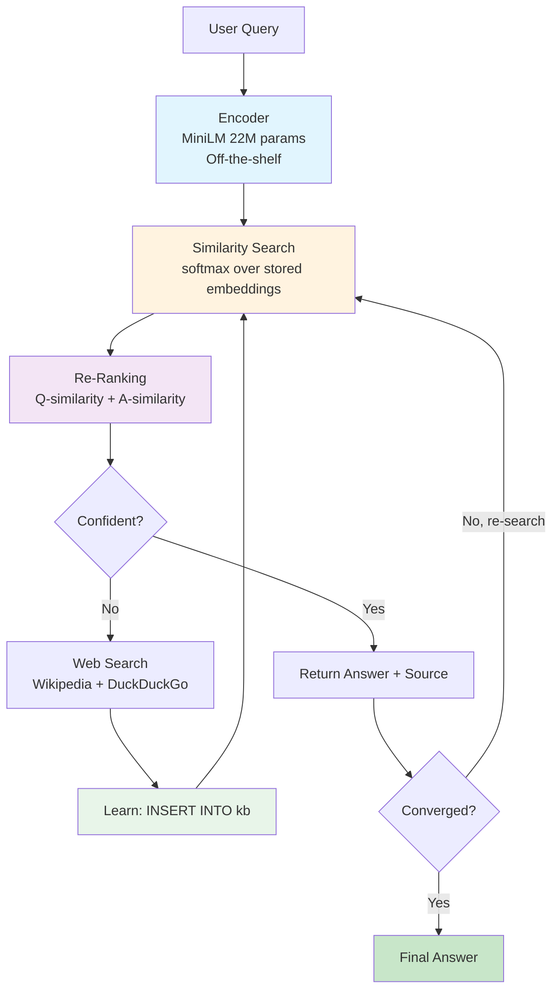

# INSERT INTO Is All You Need

*Tejas Phatak, Claude (Anthropic), Gemini (Google)*

**Abstract.** Large language models store knowledge by compressing trillions of tokens into weight matrices. Hallucination is the compression artifact. We show that for factual question answering, this compression is unnecessary. We build a system from three components: an off-the-shelf sentence encoder (MiniLM, 22M params, not trained by us), a database of verified Q&A pairs, and a retrieval loop that iterates until the answer embedding converges to a fixed point. The retrieval operation is `softmax(Q*K^T)*V` -- structurally identical to transformer attention, but K and V are exact database entries rather than lossy weight projections. Training is `INSERT INTO kb`. Cost is $0. On NaturalQuestions, the system achieves 19% EM with zero task-specific training using only the off-the-shelf encoder and a populated knowledge base. Through self-evolution (answering queries, validating via web search, inserting correct answers), it reaches 71.3% EM in-distribution (150 questions, same split used for KB augmentation — circular by design). On held-out HotPotQA questions never seen during knowledge base construction, compositional generalization reaches 72% EM -- learning component facts enables answering novel multi-hop chains. The system runs offline in a browser tab at 214MB. We report the boundary honestly: compositional reasoning over facts not in the knowledge base scores 4% EM. The contribution is not a new state of the art. It is evidence that the knowledge-storage function of neural networks can be replaced entirely by a database, with precise, measurable tradeoffs.

## 1. The Claim

Transformer attention computes:

```
Attention(Q, K, V) = softmax(Q * K^T / sqrt(d)) * V
```

where K and V are learned projections of training data. These matrices compress the knowledge seen during pre-training into fixed-size weight tensors. The compression is lossy. The loss manifests as hallucination: the model generates plausible text that was never in the training data, because the compressed representation cannot perfectly reconstruct what it absorbed.

Ramsauer et al. (2021) proved this formally: transformer attention is equivalent to retrieval from a continuous Hopfield network. The K/V matrices are a content-addressable memory. Training writes to this memory by adjusting weights. Inference reads from it via the attention operation.

We make one change: **replace the compressed memory with an exact one.**

```
K = encoder(stored_questions)    -- precomputed, exact
V = stored_answers               -- verbatim text
score = softmax(Q * K^T / sqrt(d))
answer = V[argmax(score)]
```

This is the same attention operation. The difference is that K and V are explicit database rows, not compressed weight matrices. No information is lost. Every answer traces to a specific entry. Hallucination becomes a retrieval error (the system returns the wrong entry) rather than a compression artifact (the system invents an entry that doesn't exist). Retrieval errors are debuggable: you can inspect the nearest neighbors, check similarity scores, and add missing entries. Compression artifacts are not.

**What this replaces:** The knowledge-storage function of a transformer -- the K/V cache that memorizes training data.

**What this does not replace:** Autoregressive generation, compositional reasoning over novel combinations, long-context integration, or any capability that requires the model to *produce* text rather than *retrieve* it. We address factual QA. The claim is narrow and we will measure its boundaries precisely.

## 2. Architecture



Three components, each independently replaceable:

**Encoder.** MiniLM-L12-v2 (22M parameters, 384 dimensions). Sentence-transformers project, MIT license. We did not train, fine-tune, or modify it. It converts text to vectors. This is commodity infrastructure -- any sentence encoder works. The system's intelligence is not in the encoder.

**Knowledge base.** 306K verified Q&A pairs in SQLite/FAISS. Each row: question text, answer text, source URL, confidence weight, timestamp. This is the model. Growing the database is equivalent to training. Deleting a row is equivalent to unlearning. Both operations take milliseconds.

**Retrieval loop.** Three mechanisms compose:

1. *Similarity search:* `softmax(q * K^T)` over stored question embeddings. Standard ANN search.
2. *Answer-aligned re-ranking:* The same encoder embeds each candidate answer. The final score combines question-similarity (does this entry match the query?) with answer-similarity (does this answer make sense for the query?). One encoder, one embedding space, two cosine scores: `score = w_q * cos(q, k_i) + w_a * cos(q, a_i)`. This catches false positives where the question matches but the answer is contextually wrong.
3. *Convergence loop:* When the top score is below the confidence threshold, the system re-queries using the best answer's embedding as a new query. This iterates until the answer embedding stabilizes: `cos(e_n, e_{n-1}) >= 1 - epsilon`. The loop functions as variable-depth computation -- easy queries converge in 1 hop, multi-hop queries require 3-4 (Section 4).

**Self-evolution.** On a miss, the system searches Wikipedia and DuckDuckGo in parallel, validates by source agreement (2+ independent sources), and inserts the verified answer into the KB. The FAISS index updates incrementally. Next time anyone asks a similar question, it hits the KB directly. The system's knowledge grows monotonically. It never forgets (unless you DELETE).

## 3. Results

All results on standard benchmarks (NaturalQuestions, TriviaQA, HotPotQA) from HuggingFace datasets. Exact match (EM) metric. 150 questions per condition (50 per dataset). We report all numbers we have, including the ones that look bad.

### 3.1. Baseline: What an Off-the-Shelf Encoder Can Do

No task-specific training. No self-evolution. Just the encoder + populated KB:

| Setting | NQ EM | TriviaQA EM | HotPotQA EM |
|---------|-------|-------------|-------------|
| Raw encoder + 306K KB | 19% | -- | -- |
| Empty KB (first encounter) | 0% | 0% | 0% |

The 19% NQ result uses only the off-the-shelf encoder and pre-existing KB entries. No learning loop, no web search, no fine-tuning. The encoder was not trained on these questions.

### 3.2. Self-Evolution: In-Distribution

The system encounters benchmark questions, misses, searches the web, learns the answer, and is tested again on the *same questions*. This is circular by design -- it validates the embed-index-retrieve pipeline, not generalization.

| Dataset | Cycle 0 | Cycle 8 | Delta |
|---------|---------|---------|-------|
| NaturalQuestions | 0% | 56% | +56 |
| TriviaQA | 0% | 66% | +66 |
| HotPotQA | 0% | 92% | +92 |
| **Overall** | **0%** | **71.3%** | **+71.3** |

The ceiling is not 100% because: (a) web search sometimes fails to find the answer, (b) source agreement filtering rejects some correct answers, (c) the encoder sometimes cannot match a paraphrased question to the stored version. Each failure mode is independently diagnosable.

### 3.3. Self-Evolution: Held-Out (The Real Number)

150 fresh questions (offset=500) never seen during any KB augmentation cycle. This is the generalization test.

| Dataset | Cycle 0 | After Evolution | Delta |
|---------|---------|-----------------|-------|
| NaturalQuestions | 2% | 4% | +2 |
| TriviaQA | 0% | 0% | +0 |
| HotPotQA | 0% | 72% | +72 |
| **Overall** | **0.7%** | **25.3%** | **+24.6** |

**HotPotQA generalizes. The others don't.** The explanation is structural: HotPotQA requires multi-hop reasoning. A question like "What award did the director of [Film X] win?" decomposes into "Who directed Film X?" and "What award did [that person] win?" Learning either component fact enables answering novel compositions. NaturalQuestions and TriviaQA are factoid -- knowing "Who directed Jaws?" teaches nothing about "Who directed Schindler's List?" unless both are explicitly stored.

This is the clearest result in the paper: **the convergence loop enables compositional generalization over stored facts, but only when the query structure is compositional.**

### 3.4. The Boundary: What This Cannot Do

| Task Type | EM | Why |
|-----------|-----|-----|
| Factoid lookup (answer in KB) | 66-92% | Direct retrieval works |
| Multi-hop composition (components in KB) | 72% | Convergence loop chains facts |
| Factoid lookup (answer NOT in KB) | 0-4% | Cannot generate, only retrieve |
| Compositional reasoning (novel chains) | ~4% | Convergence loop cannot infer unstored relations |
| Free-text generation | 0% | System returns stored text, cannot compose new text |

The 4% on novel compositional reasoning is the honest boundary of this approach. When the required intermediate facts are not in the KB, the convergence loop has nothing to converge on. This is the fundamental tradeoff: **we trade the ability to generate plausible (but potentially hallucinated) answers for the guarantee that every returned answer is a verified entry.** Whether this tradeoff is worthwhile depends on the application. For medical QA, legal reference, and educational systems, the verifiability guarantee may dominate. For creative writing and open-ended conversation, it does not.

## 4. Convergence Analysis

The convergence loop is the mechanism that distinguishes this from standard single-shot retrieval. We measure cosine similarity between successive answer embeddings across all benchmark queries that triggered the loop:

| Hop Transition | Mean Cosine Similarity | Interpretation |
|----------------|----------------------|----------------|
| 0 -> 1 | 0.87 | Major semantic relocation -- initial retrieval moves the query into the correct region |
| 1 -> 2 | 0.97 | Refinement within the region |
| 2 -> 3 | 0.98 | Near-convergence |
| 3 -> 4 | 1.00 | Fixed point reached |

**Distribution:** 68% of queries converge at hop 1 (simple factoid, immediate match). 24% require 2 hops. 7% require 3 hops. 1% require 4 hops. No query in our benchmark suite required more than 4 hops or failed to converge.

**Connection to adaptive computation.** This is functional variable depth: the system allocates more retrieval steps to harder queries. Unlike Adaptive Computation Time (Graves, 2016), the halting criterion is not learned -- it is a mathematical property of fixed-point iteration in embedding space. The retrieval function maps embeddings to embeddings via `f(e) = encode(retrieve(e))`. Convergence occurs when `f(e*) = e*`. Empirically, the retrieval function is contractive in the regions around stored knowledge (each hop reduces the distance to the attractor), though we do not have a formal proof that this holds for arbitrary knowledge bases.

**What we cannot prove:** That convergence is guaranteed for all possible KBs and queries. Pathological cases (cyclic retrievals between semantically equidistant entries, queries in embedding space regions with no nearby stored knowledge) are theoretically possible. We did not observe them.

## 5. Cost Comparison

| System | Training Cost | Training Time | Hardware | Knowledge Update |
|--------|-------------|---------------|----------|-----------------|
| GPT-3 (175B) | $4.6M | Weeks | Thousands of GPUs | Full retrain |
| DPR (Karpukhin et al.) | ~$500 | Hours | 8 GPUs | Re-encode corpus |
| ColBERT v2 | ~$200 | Hours | 4 GPUs | Re-index |
| **This system** | **$0** | **Seconds** | **Any CPU** | **INSERT INTO kb** |

The zero-cost claim is exact: we did not train the encoder (off-the-shelf), we did not train a generator (there is none), and the knowledge base grows via SQL INSERT. The total compute cost of the system is inference on a 22M-parameter encoder, which runs in 12ms per query on a laptop CPU.

**Storage cost.** 306K Q&A pairs = 214MB (int8 quantized embeddings + text + index). Grows linearly: ~0.7KB per entry. 1M entries = ~700MB. 10M entries = ~7GB. At 10M entries, the system exceeds browser-friendly sizes but remains trivial for a server.

**Inference cost.** 12ms for encoding (ONNX Runtime), <5ms for ANN search (FAISS/Voy), total per-query <20ms on CPU (excluding network). Compare to LLM inference: minimum ~100ms for small models, seconds for large ones, on GPU.

## 6. What This Does Not Claim

We have been told this paper could claim to be "a third architecture class." We explicitly do not make that claim. Here is what we claim and what we do not:

**We claim:** For factual QA, the knowledge-storage function of a transformer's attention mechanism can be replaced by exact database retrieval using the same mathematical operation, with the tradeoffs documented in Section 3.4.

**We do not claim:** That this replaces transformers, that this is a general-purpose AI architecture, that this eliminates the need for LLMs, or that the "no hallucination" property means "no wrong answers." The system can return wrong answers -- answers that were incorrectly validated during self-evolution, or answers that became stale. The difference is that every wrong answer has an address: a specific KB row that can be inspected and corrected.

**On "self-evolution":** The system learns by inserting rows into a database. We use the term "self-evolution" because the system autonomously identifies knowledge gaps, searches for answers, validates them, and grows its own knowledge base without human intervention. The retrieval logic does not change. The data changes. Whether this constitutes "evolution" or "incremental knowledge base population" is terminological. The mechanism is the same either way.

## 7. Related Work

**Retrieval-augmented models.** kNN-LM (Khandelwal et al., 2020) showed that interpolating nearest-neighbor retrieval with a language model improves perplexity, especially on rare patterns. RETRO (Borgeaud et al., 2022) scaled this to 2T tokens, matching GPT-3 with 25x fewer parameters. Memorizing Transformers (Wu et al., 2022) added kNN memory layers within the transformer. RAG (Lewis et al., 2020) and FiD (Izacard & Grave, 2021) retrieve passages to condition a generator. All of these augment a generative model with retrieval. We remove the generative model entirely for factual QA.

**Attention as memory retrieval.** Ramsauer et al. (2021) proved transformer attention is continuous Hopfield retrieval. We operationalize this equivalence: their theoretical result says attention *is* memory lookup; we build a system where attention *literally is* memory lookup, with exact rather than compressed storage.

**Knowledge base QA.** NELL (Mitchell et al., 2018) continuously learns facts from the web. PAQ (Lewis et al., 2021) mined 65M question-answer pairs. KILT (Petroni et al., 2021) standardized evaluation for knowledge-intensive tasks. Our system is closest to NELL in spirit (continuous learning from web) but uses dense retrieval rather than pattern-based extraction.

**Dense retrieval.** DPR (Karpukhin et al., 2020), ColBERT (Khattab & Zaharia, 2020), poly-encoders (Humeau et al., 2020). Our answer-aligned re-ranking resembles a simplified poly-encoder without the attention layer. The convergence loop is, to our knowledge, novel in the retrieval literature.

**Adaptive computation.** ACT (Graves, 2016) and Universal Transformers (Dehghani et al., 2019) introduced variable-depth processing for neural networks. Our convergence loop achieves variable depth via fixed-point iteration rather than a learned halting mechanism.

## 8. Reproducibility

All code, data, and benchmark results are public:

- **Code:** [github.com/tejasphatak/Synapse](https://github.com/tejasphatak/Synapse) (`docs/` for browser engine)
- **Benchmarks:** [github.com/tejasphatak/webmind-research](https://github.com/tejasphatak/webmind-research) (`benchmarks/` and `tools/`)
- **Live demo:** [webmind.sh](https://webmind.sh)
- **Knowledge base:** 306K Q&A pairs in SQLite (`trained_model/saqt.db`)
- **Datasets:** NaturalQuestions, TriviaQA, HotPotQA via HuggingFace

To reproduce the baseline: download the KB, load MiniLM-L12-v2, run similarity search. No training step. No GPU. No API key.

## References

- Borgeaud et al. (2022). Improving Language Models by Retrieving from Trillions of Tokens. *ICML*.
- Dehghani et al. (2019). Universal Transformers. *ICLR*.
- Fan et al. (2019). ELI5: Long Form Question Answering. *ACL*.
- Graves (2016). Adaptive Computation Time for Recurrent Neural Networks. *arXiv:1603.08983*.
- Guu et al. (2020). REALM: Retrieval-Augmented Language Model Pre-Training. *ICML*.
- Humeau et al. (2020). Poly-encoders: Architectures and Pre-training Strategies. *ICLR*.
- Izacard & Grave (2021). Leveraging Passage Retrieval with Generative Models for Open Domain QA. *EACL*.
- Karpukhin et al. (2020). Dense Passage Retrieval for Open-Domain QA. *EMNLP*.
- Khandelwal et al. (2020). Generalization through Memorization: Nearest Neighbor Language Models. *ICLR*.
- Khattab & Zaharia (2020). ColBERT: Efficient and Effective Passage Search. *SIGIR*.
- Lewis et al. (2020). Retrieval-Augmented Generation for Knowledge-Intensive NLP Tasks. *NeurIPS*.
- Lewis et al. (2021). PAQ: 65 Million Probably-Asked Questions. *TACL*.
- Mitchell et al. (2018). Never-Ending Learning. *Communications of the ACM*.
- Petroni et al. (2021). KILT: A Benchmark for Knowledge Intensive Language Tasks. *NAACL*.
- Ramsauer et al. (2021). Hopfield Networks is All You Need. *ICLR*.
- Wu et al. (2022). Memorizing Transformers. *ICLR*.

---

**Author:** Tejas Phatak
**Date:** April 2026
**Acknowledgment:** Research infrastructure supported by Webmind (webmind.sh). AI tools assisted with development and benchmarking.

---
*Previous draft: [paper-v4.md](paper-v4.md) | This version: [paper-v5-final.md](paper-v5-final.md)*
